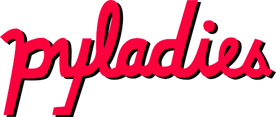
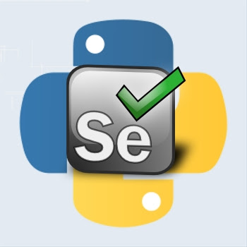

Vítejte
-------

<p align="center">
<br>
<br>
<br>
  &nbsp;&nbsp;&nbsp;&nbsp;&nbsp;&nbsp;&nbsp;  
<br>
<br>
<br>
<br>
<br>
<br>
</p>

************

<details>
<summary>_ORGANIZAČNÍ POZNÁMKA_</summary>
připojení počítačů, tištěné materiály, seznámení, icebreaker<br>90 min.
</details>

************


Proč jsme tady?
---------------

Cílem kurzu je připravit účastníky na roli testera v prostředí webových aplikací.

Kurz je koncipovaný, jako otevřený s ohledem na rovné příležitosti na trhu práce, a díky altruismu organizátorů a podpoře partnerů [PyLadies](http://pyladies.cz) je zdarma.


**Sobota**

 - Úvod do testování.
 - Co je to _bug_ a jak se reportuje?
 - Hackujeme vlastní počítač.
 - Manuální testy - Jak se navrhují a jak se dokumentují?
 - Představení aplikace Oscar.


**Neděle**

 - Automatizované testy
 - Pokusy na maých příkladech
 - Kolektivní workshop: django-oscar test automation


Pěkně vystihla charakter kurzu jedna z organizátorek.

> M. K. [13. 1. 2017 10:30]
> no, to je otázka, co je vlastně cílem toho kurzu... je jasný, že __z účastníků nebudou v pondělí experti na automatický testování__, ani že nebudou schopný přijít do firmy a postavit si tam sami celou testovací linku.. __jde o to, aby se dozvěděli, jak se testuje a proč a že vedle manuálního testování existuje i automatický testování, který se dá psát v Pythonu__ (jehož základy už uměj) a že je to efektivní. __cílem je, aby účastník mohl jít na pohovor na pozici testera a nebyl tam za úplnýho amatéra__ a v případě, že by to byla firma, která testuje jen manuálně, tak aby uměl vznést návrh na to, aby se začlo testovat automaticky.

<br>
<br>
<br>
<br>
<br>
<br>

************

<details>
<summary>_ORGANIZAČNÍ POZNÁMKA_</summary>
vize organizátorů, představení očekávání účastníků
</details>


************


Program prvního dne
-------------------

- 09:00 - zahájení, docházka, skill check

- 10:30 - co je to testování software

- __12:00 - oběd__

- 13:00 - seznámení se s testovanou aplikací Oscar

- 13:30 - tipy a triky na vlastním počítači - inspector v prohlížeči

- 14:15 - manuální testování - čtení scénářů

- __14:30 - odpolední káva__

- 15:00 - manuální testování na příkladech

- 15:30 - od manuálního testování k automatizaci

- 16:00 - diskuze a ukončení


<br>
<br>
<br>
<br>
<br>
<br>

************

Inspirace do začátku
--------------------

Nejdříve vyzkoušíme, že máme funkční všechno potřebné, viz. [instalace](../../instalace).

 1. zapnout terminál
 2. vlézt do adresáře, kde je udělaná instalace
 3. zapnout venv
 4. spustit `python ./test_installation.py`

Pokud je výstup v konzoli `Test OK` tak je vše v pořádku, jinak napíše `Sorry, it didn't work`

Vytvoř nový soubor `test_dochazka.py`, otevři si ho pro editaci a napiš malý program v Pythonu.

```
# z modulu selenium naimportuj webdriver
# vytvor instanci webdriver.Chrome('chromedriver')
# na instanci zavolej .get('https://testshop.pyladies.cz/')
```

Program spusť pomocí `python ./test_dochazka.py`.

Co se stalo? Nové okno prohlížeče není žádný objev, tak si jdeme hrát!

Změn adresu v prohlížeči na `https://testshop.pyladies.cz/<tvůj email>`. Co je to za stránku a proč je tam tolik informací?

Udělej stejnou změnu v souboru `test_dochazka.py` a spusť ho.

Proč se nám okno nezavře? Jak to spravíme? Líbí se nám to?

A kde je teda ta docházka?

<br>
<br>
<br>
<br>
<br>
<br>

************

<details>
<summary>_ORGANIZAČNÍ POZNÁMKA_</summary>
docházka pomocí 404 - [test_dochazka.py](../../instalace/test_dochazka.py)<br>ukázat jak vypadá regulérní 404, proč není zdvořilé psát do adresy nějaké cizí servery?<br>`grep " 404 " /var/log/nginx/access-testshop.pyladies.cz.log | cut -d " " -f 7 | sed -e "s/^.//" | grep @ | sort | uniq`
</details>


************

Skill Check
-----------

K zamyšlení:

- Vlastní notebook a správný software (OS, tabulkový procesor, editor)

- Kde máš hostovaný mail a proč?

- Pohyb v terminálu - cd, ls / dir, spuštění příkazu ([GOW](https://github.com/bmatzelle/gow), [git bash](https://git-scm.com/download/win))

- Základní znalost konceptů programování - for cyklus, if

- Psaní na “programátorské” klávesnici - jak rychle dokážeš napsat ``

- Umiš udělat screenshot? Kde je uložený, jak se dá "hodit na net"?

- Máš účet na githubu? Přihlaš se k repozitáři kurzu `https://github.com/PyLadiesCZ/TestLadiesSandbox`

<br>
<br>
<br>
<br>
<br>
<br>

************

<details>
<summary>_ORGANIZAČNÍ POZNÁMKA_</summary>
proč musím rozumět svému počítači<br>soutěž o první issue na github
</details>

************
