Co je to testování software
---------------------------

- co je to software?
- co je to testování?
- co je to kvalita?

> Whatever the definition, it is true that quality is something we all aspire to.

http://softwaretestingfundamentals.com/software-quality/

http://softwaretestingfundamentals.com/dimensions-of-software-quality/

http://softwaretestingfundamentals.com/software-testing-myths/

Proč je testování SW důležité?
------------------------------

V konečném důsledku způsobují chyby v SW ztráty (bohužel i ty nejhorší) https://youtu.be/TDynSmrzpXw?list=PLDC2A0C8D2EC934C7

Zkuste se zamyslet, co se může stát při kopírování souboru https://youtu.be/rFaWOw8bIMM?list=PLDC2A0C8D2EC934C7

_ORGANIZAČNÍ POZNÁMKA_

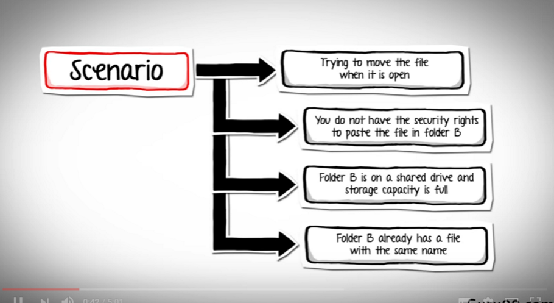

O čem je a o čem není tento kurz
--------------------------------

Testování software je mnoho různých typů.

- Praktické testování webů - __to jsme my!__
- Desktopové systémy - úzkoprofilové - korporátní starší systémy
- Embedded systémy - formální - např. vyhýbky na železnici

zdroj http://slideplayer.com/slide/1493816/

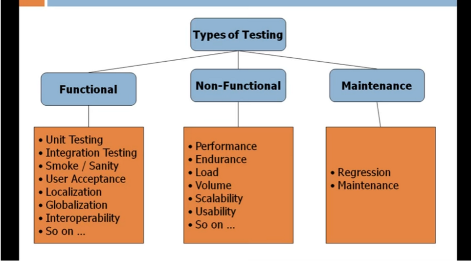

zdroj https://youtu.be/n2A9OakDYcY?list=PLDC2A0C8D2EC934C7

- Unit testing - v Pythonu např. https://hypothesis.readthedocs.io/en/latest/
- Akceptace - to nás zajímá - jak se to formalizuje?

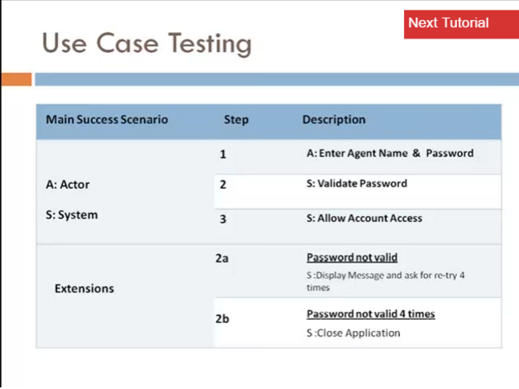

Usability testing
-----------------

testování použitelnosti - to je sranda, ale netýká se nás to - https://en.wikipedia.org/wiki/Usability_testing

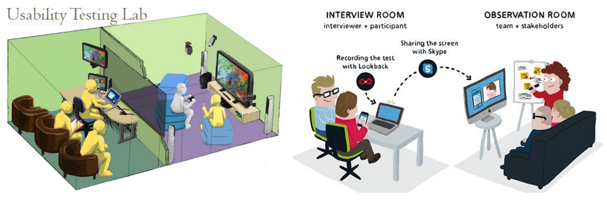

zdroje https://lynnewatanabe.wordpress.com/2011/08/24/could-usability-testing-of-websites-help-non-profits-heck-yeah/ https://medium.com/@nickvanderlinde/how-we-do-user-testing-at-mirabeau-223996ad841f

Software lifecycle (životní cyklus)
-----------------------------------

interaktivní hra - seřadit fáze životního cyklu

Obrázky

 
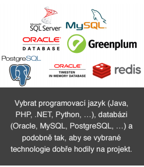 
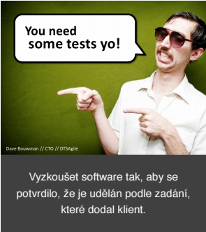 
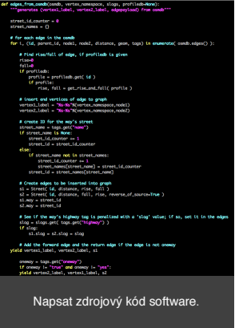

Fáze

 
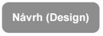 
 
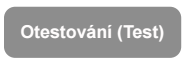 
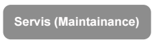 

_ORGANIZAČNÍ POZNÁMKA_

original inspirace 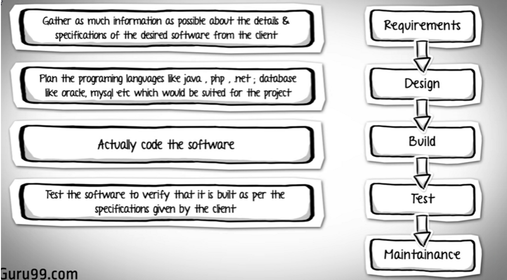 
zdroj https://youtu.be/An7HC1LolDM?list=PLDC2A0C8D2EC934C7

Kdo co dělá?
------------

Jaké role se podílejí na jednotlivých fázích projektu?

Metodiky vývoje
---------------

Waterfall, V-model, Spiral, Agile

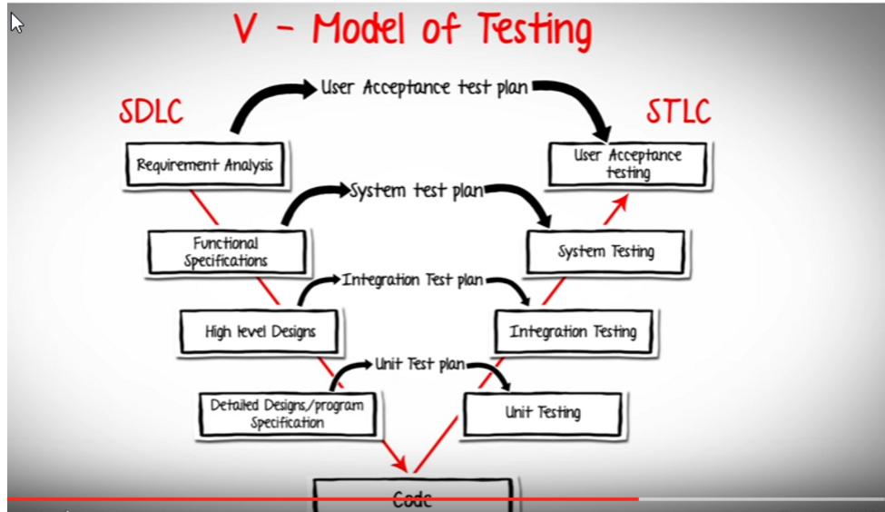

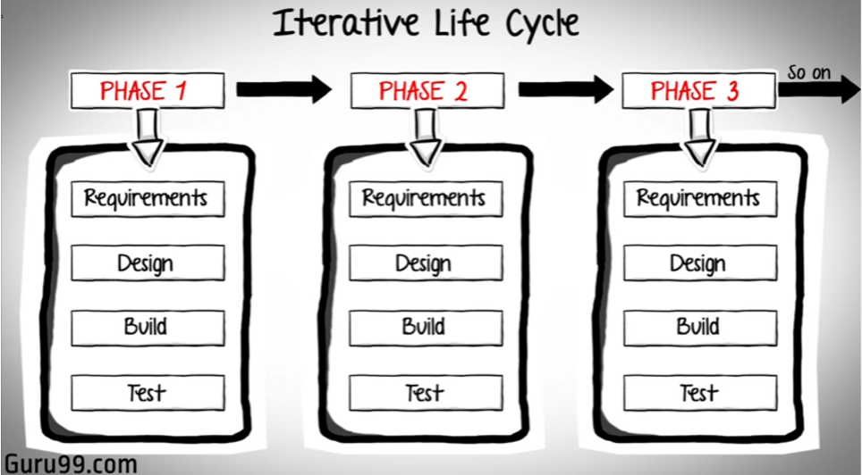

Metodiky provozu ITIL
---------------------

continuous improvement

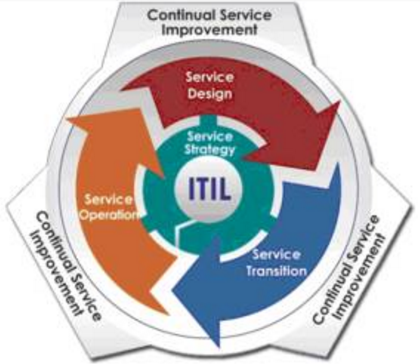

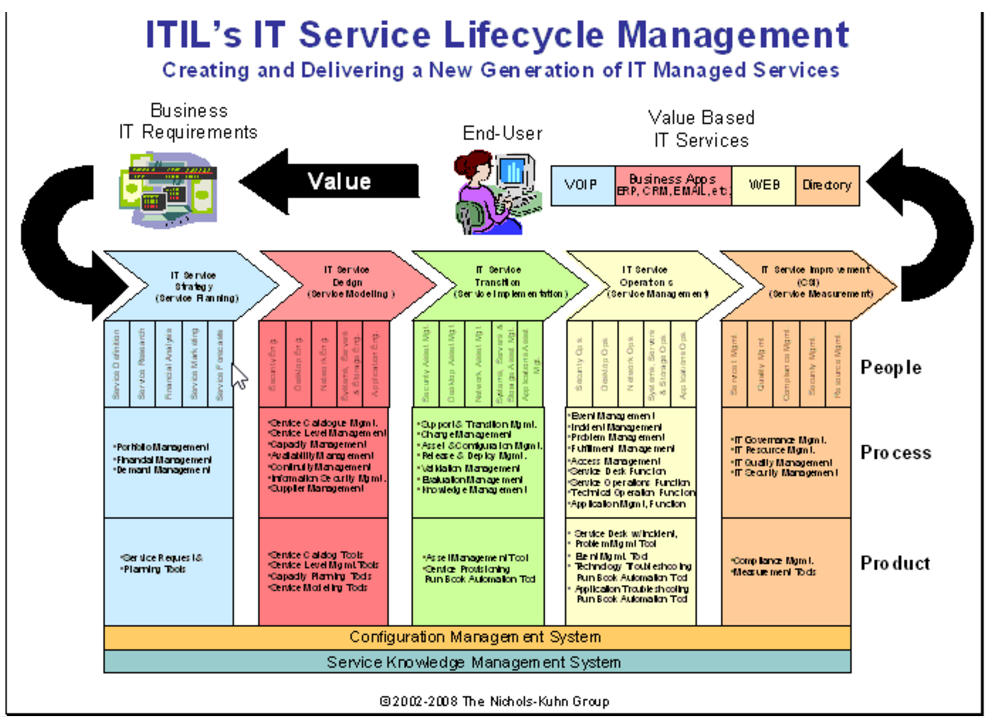

zdroj http://www.itsmsolutions.com/newsletters/DITYvol4iss01.htm

Jak to budeme dělat?
--------------------

Bušit, jako hluší do vrat - tzv. black box testing

Praktická ukázka, např. PSČ (najít, screenshot, založit ticket)

Co je to ten bug?
-----------------

https://en.wikipedia.org/wiki/Software_bug

Teorie k reportování chyb
-------------------------

ruzne ukazky ticketovacich toolu

- jira
- github
- bitbucket
- trac
- redmine

zdroj: https://youtu.be/EKv85-K_6w4?list=PLDC2A0C8D2EC934C7

github.com :heart:
------------------

Repozitář kódu

Dokumentace

Ticket tool - issues

Teorie k životu issue
---------------------

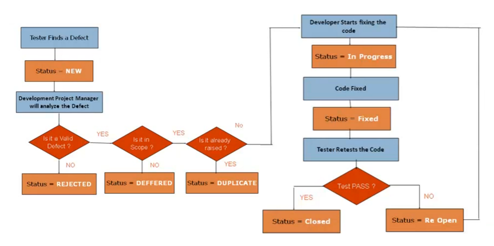

zdroj https://youtu.be/NpDZ2NJmDrE?list=PLDC2A0C8D2EC934C7

Co je pod pokličkou projektu
----------------------------

- Víš jak přibližně funguje web? Jaký je rozdíl mezi hostingem a DNS jménem?

- Kde je to co testujeme - dev, qa, prod

- oddělená data
  - Aplikace | Databáze
  - https://www.google.com/search?q=web+application+schema&source=lnms&tbm=isch&sa=X#tbm=isch&q=web+application+tiers https://www.safaribooksonline.com/library/view/internet-world/9780132990455/ch17lev1sec3.html

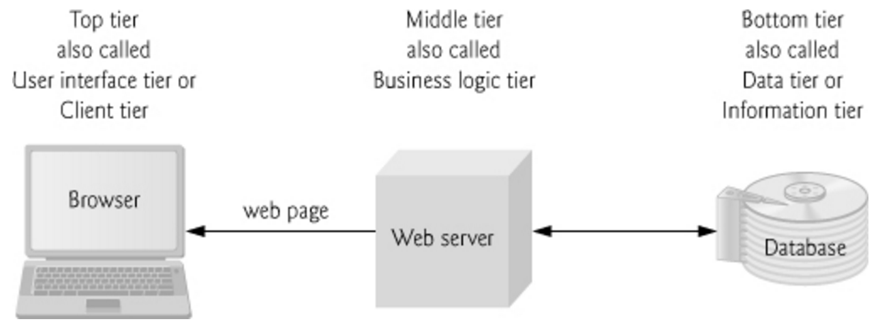

- Co s tím budeme dělat
  - Kopie projektu s testovací databází

