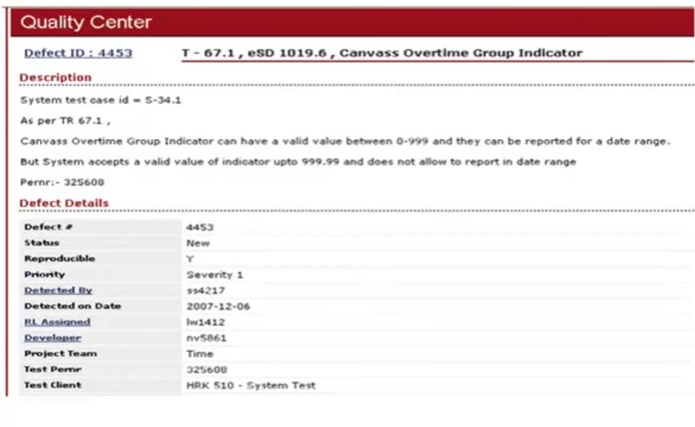

_velmi silne TODO_

seznámení se s testovanou aplikací
==================================

Vybran projekt django oscar - e-shop

http://testshop.pyladies.cz

Ukázka použití jednotlivých nástrojů (odhalení chyby a její nareportování)
===========================================================================

Screenshot na github efektivněji

---------------------

Jak napsat test case https://youtu.be/BBmA5Qp6Ghk?list=PLDC2A0C8D2EC934C7 obsahuje sablonu

---------------------

GHERKIN

---------------------

Teorie k reportování chyb https://youtu.be/EKv85-K_6w4?list=PLDC2A0C8D2EC934C7

ruzne ukazky ticketovacich toolu

- jira
- github
- bitbucket
- trac
- redmine

---------------------

Teorie k životu issue https://youtu.be/NpDZ2NJmDrE?list=PLDC2A0C8D2EC934C7

