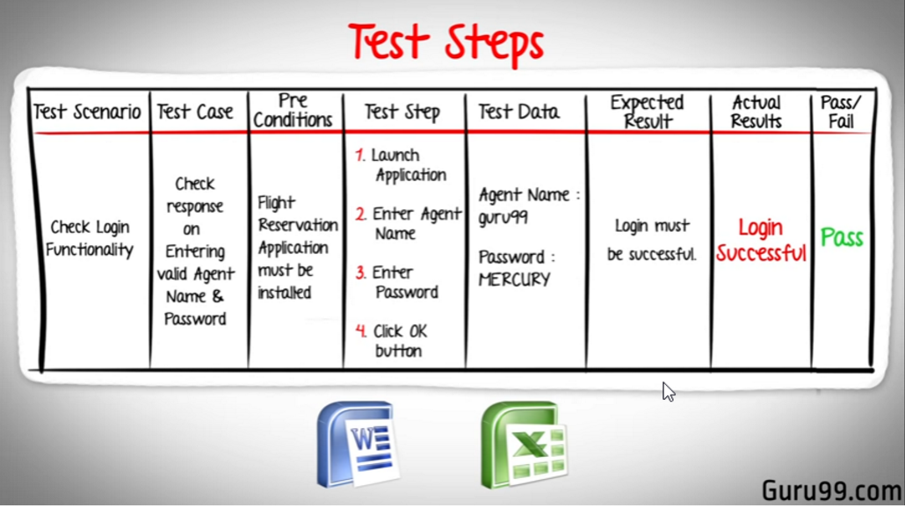
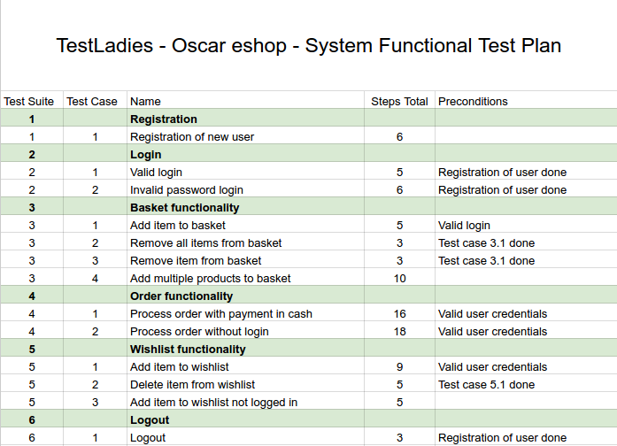

Jak napsat test case?
---------------------

zdroj: https://youtu.be/BBmA5Qp6Ghk?list=PLDC2A0C8D2EC934C7 obsahuje sablonu

---------------------

Ale i tohle je testovací scénář (jazyk GHERKIN)

Seznámení se s testovacími scénáři
----------------------------------

Čtení scénářů aneb literární koutek

https://drive.google.com/open?id=11uUH0CkvchYoKrigHKu_vvaE83CeMYxl0y-L3sv725o

