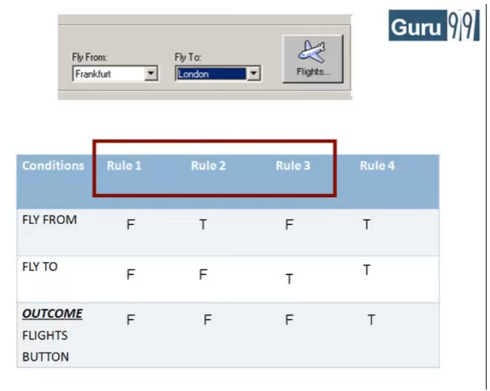

Vytvořit strukturu podle test planu.

Postupně ukázat jednotlivé testy.

Kombinace Live coding a samostatné práce.

zdrojáky [src/](../../src)

Pokročilejší teorie
-------------------

nadstavbové téma, je možné vynechat

zkusit implicit waits http://www.seleniumhq.org/docs/04_webdriver_advanced.jsp#implicit-waits

-------------------

Equivalence checking - boundary value analysis - zmenšení počtu variant

-------------------

Decision table - zmenšení počtu variant

-------------------

State transition diagram

-------------------

