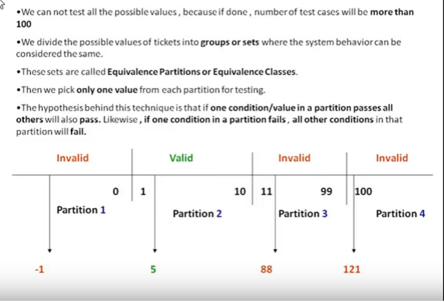
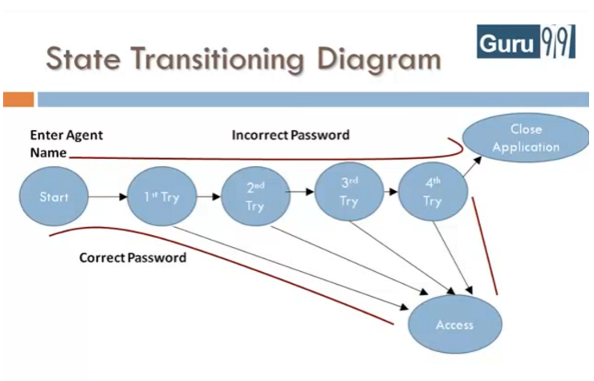

_velmi silne TODO_

Pokročilejší teorie
-------------------

nadstavbové téma, je možné vynechat

zkusit implicit waits http://www.seleniumhq.org/docs/04_webdriver_advanced.jsp#implicit-waits

-------------------

Equivalence checking - boundary value analysis - zmenšení počtu variant

-------------------

Decision table - zmenšení počtu variant

-------------------

State transition diagram

-------------------

výstupní automatický test aneb grande finale
--------------------------------------------

Nasadime pokazeny kod a vsichni spusti testy.

Open source - nejlépe skutečný problém i třeba již opravený - udělat fork před opravou pro nás

Nová funkčnost, je třeba zareportovat bug, napsat automatizovaný test a sledovat, až ho někdo opraví

Ukázka použití uptimerobot - je to smoke/sanity test

